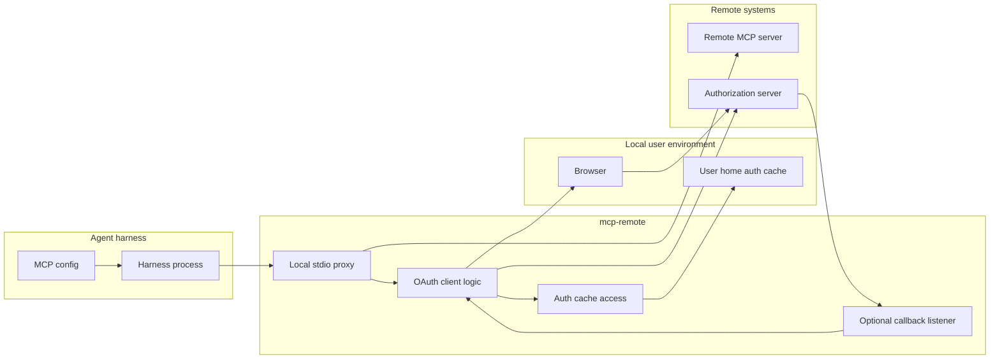
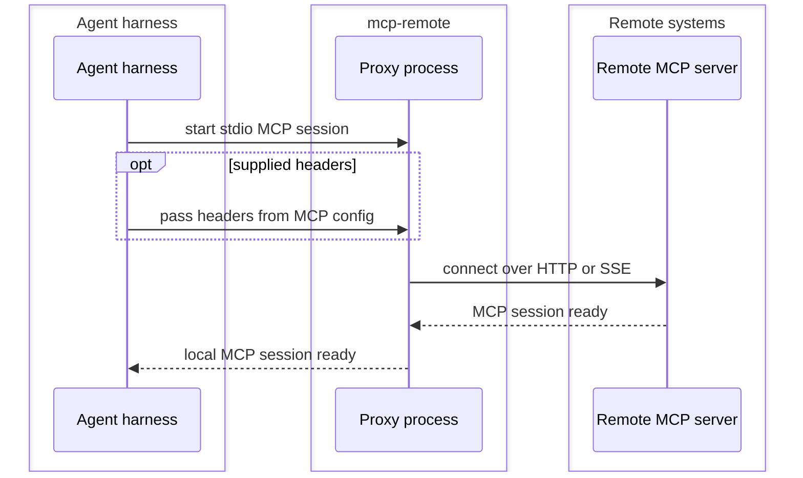
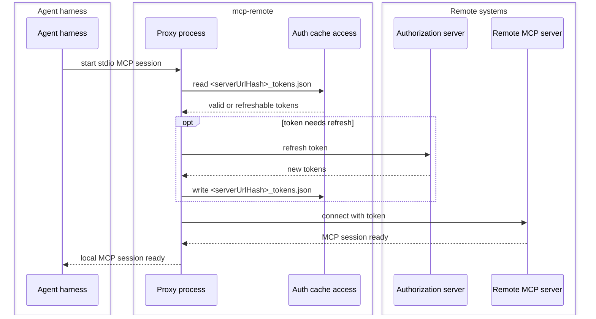
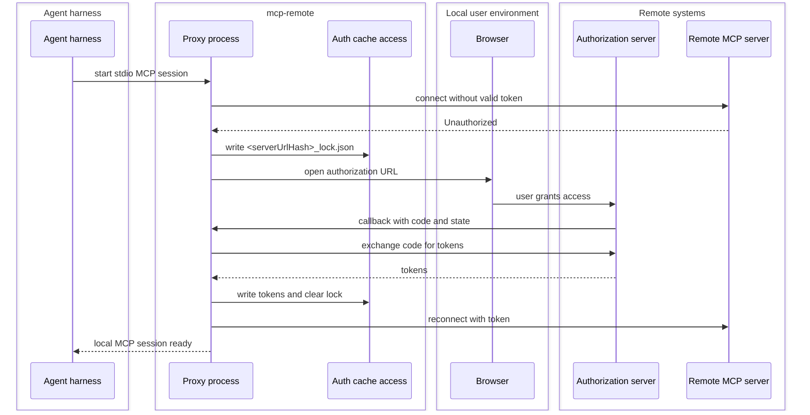
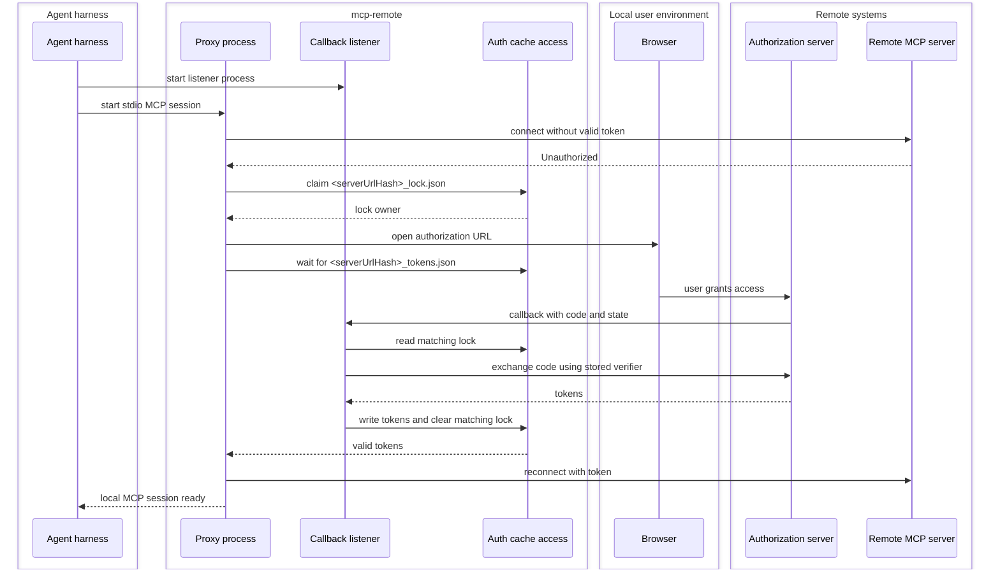
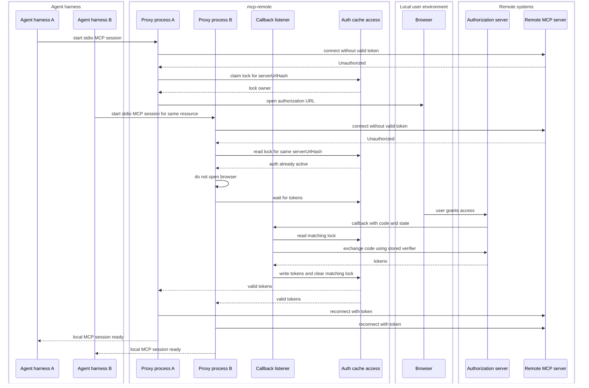
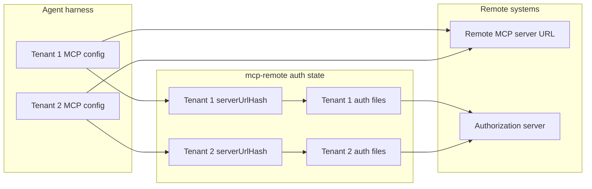
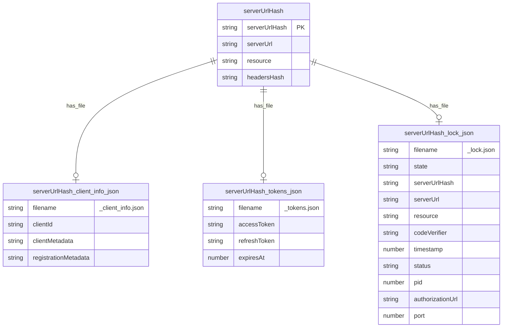

# `mcp-remote` Proxy And Auth Design

## Summary

`mcp-remote` is a local stdio MCP server that lets an agent harness use a remote
MCP server over HTTP or SSE.

It supports several ways to reach the remote MCP server:

- no auth, when the remote MCP server allows it
- caller supplied headers, including bearer tokens
- OAuth using cached tokens
- OAuth authorization code flow with one local process handling callback
- OAuth authorization code flow with a separate callback listener process

The main reliability problem is OAuth coordination. Several agent harnesses can
start separate `mcp-remote` processes for the same remote resource. For one
`serverUrlHash`, those processes must behave like one auth coordinator: one
process opens the browser, the other processes wait, the callback handler writes
tokens, and all waiters continue with the same token file.

## Goals

| Goal                          | Meaning                                                                                     |
| ----------------------------- | ------------------------------------------------------------------------------------------- |
| Proxy stdio to remote MCP     | Let an agent harness use a remote MCP server through a local stdio MCP process.             |
| Support common auth setups    | Work with no auth, supplied headers, cached OAuth tokens, and browser based OAuth.          |
| One browser auth per resource | For one `serverUrlHash`, concurrent processes must not open multiple auth windows.          |
| Shared token visibility       | When auth succeeds, all waiting processes for that `serverUrlHash` must see the new tokens. |
| Resource isolation            | One remote MCP server URL can serve multiple resources, each with separate auth files.      |
| Simple recovery               | Stale or failed auth attempts must not block future auth forever.                           |

## System Responsibilities

| Area          | `mcp-remote` owns                                                           | Outside `mcp-remote`                       |
| ------------- | --------------------------------------------------------------------------- | ------------------------------------------ |
| Local MCP     | stdio MCP process exposed to the agent harness                              | agent harness lifecycle and config         |
| Remote MCP    | HTTP or SSE connection and transport fallback                               | remote MCP server behavior                 |
| Supplied auth | forwarding configured headers                                               | issuing externally supplied tokens         |
| OAuth client  | discovery, client info, token read and write, refresh, browser auth trigger | authorization server policy and consent UI |
| Callback      | local callback listener and code exchange                                   | user credential entry in the browser       |
| Coordination  | shared token and lock files under the auth cache                            | process supervisor used by the harness     |

## System Context



The base MCP invocation is always left to right: agent harness, local
`mcp-remote`, remote MCP server. OAuth adds the browser, authorization server,
auth cache, and optional callback listener.

## Constraints

- The agent harness talks to `mcp-remote` over stdio.
- The remote MCP connection uses HTTP or SSE.
- Several harness processes may start separate `mcp-remote` processes.
- Separate `mcp-remote` processes coordinate only through the auth cache.
- In split callback mode, the listener owns the callback port.
- In split callback mode, normal proxy processes do not bind the callback port.

## Key Terms

| Term              | Meaning                                                                                   |
| ----------------- | ----------------------------------------------------------------------------------------- |
| Remote MCP server | The MCP server reached over HTTP or SSE.                                                  |
| Agent harness     | The local client or agent runtime that starts `mcp-remote`.                               |
| Proxy process     | The `mcp-remote` process serving stdio MCP to one harness instance.                       |
| Callback listener | The `mcp-remote --listen-only` process that receives OAuth callbacks.                     |
| Resource          | The remote resource identifier used to separate auth state. For example, two tenant URLs. |
| `serverUrlHash`   | Hash of `serverUrl`, `resource`, and headers. It is the auth file prefix.                 |
| Auth cache        | The directory that stores client info, tokens, locks, and debug logs.                     |
| Auth lock         | The file that represents one active auth attempt for one `serverUrlHash`.                 |

## Auth And Invocation Modes

| Mode                          | When used                                                             | Auth behavior                                                                                             |
| ----------------------------- | --------------------------------------------------------------------- | --------------------------------------------------------------------------------------------------------- |
| No auth                       | Remote MCP server accepts unauthenticated requests.                   | `mcp-remote` connects directly.                                                                           |
| Supplied headers              | Harness config provides headers, such as `Authorization: Bearer ...`. | `mcp-remote` forwards the headers and does not run OAuth.                                                 |
| OAuth token reuse             | Token file exists for the `serverUrlHash`.                            | `mcp-remote` reads tokens from the auth cache.                                                            |
| OAuth token refresh           | Token file exists but needs refresh.                                  | `mcp-remote` refreshes tokens through the authorization server.                                           |
| OAuth single process callback | No fixed callback listener is used.                                   | One proxy process opens the browser, receives the callback, exchanges code, and writes tokens.            |
| OAuth split callback          | A fixed callback listener is used.                                    | A proxy process opens the browser; the listener receives the callback, exchanges code, and writes tokens. |

Static OAuth client metadata and static OAuth client information are OAuth client
configuration choices. They change how the OAuth client identifies itself to the
authorization server. They do not change the runtime coordination model.

Multiple resources are a configuration pattern, not a separate auth mode. Each
resource produces a different `serverUrlHash` and therefore a different file set.

## Runtime Flows

### No Auth Or Supplied Headers



### OAuth Token Reuse Or Refresh



### OAuth Single Process Callback



### OAuth Split Callback



## Concurrency Behavior

The repeated browser window problem happens when more than one harness starts
`mcp-remote` for the same OAuth protected resource before auth has finished.

For one `serverUrlHash`, the auth cache must make those separate processes act
like one logical coordinator:

- the first process that claims the lock owns the browser auth attempt
- later processes for the same `serverUrlHash` must not open a browser
- later processes wait for `<serverUrlHash>_tokens.json`
- the callback handler writes tokens once and clears only the matching lock



## Multiple Resources

Resource separation is an auth storage concern. MCP invocation still goes to the
configured remote MCP server URL. Auth files are separate because the resource
value is part of `serverUrlHash`.

Example:

| MCP config | Resource input                | Derived file prefix    | Files owned by that resource                                                                                  |
| ---------- | ----------------------------- | ---------------------- | ------------------------------------------------------------------------------------------------------------- |
| Tenant 1   | `https://tenant1.example.com` | `tenant1ServerUrlHash` | `tenant1ServerUrlHash_client_info.json`, `tenant1ServerUrlHash_tokens.json`, `tenant1ServerUrlHash_lock.json` |
| Tenant 2   | `https://tenant2.example.com` | `tenant2ServerUrlHash` | `tenant2ServerUrlHash_client_info.json`, `tenant2ServerUrlHash_tokens.json`, `tenant2ServerUrlHash_lock.json` |



The diagram separates MCP invocation from auth state:

- MCP invocation uses the configured remote MCP server URL.
- Auth storage uses `serverUrlHash`.
- Different resources can invoke the same remote MCP server while using separate
  token and lock files.

## Storage Model



| File                               | Owner                       | Purpose                                            |
| ---------------------------------- | --------------------------- | -------------------------------------------------- |
| `<serverUrlHash>_client_info.json` | OAuth provider              | Stores dynamic or static OAuth client information. |
| `<serverUrlHash>_tokens.json`      | OAuth provider and listener | Stores access and refresh tokens.                  |
| `<serverUrlHash>_lock.json`        | Auth coordinator            | Stores the active auth attempt.                    |

The lock file is only for auth that is in progress. It is not a token cache.

## Auth Lock Contract

The auth lock prevents multiple browser windows for the same OAuth protected
resource.

Without a shared lock, two proxy processes can both receive `Unauthorized`, both
start OAuth, and both open a browser window. The user then sees repeated auth
prompts, and callbacks from older browser windows can interfere with newer auth
attempts.

For one `serverUrlHash`, there is at most one active auth lock. The OAuth
`state` uses this format:

```text
<random id>:<serverUrlHash>
```

The random id protects the OAuth flow. The `serverUrlHash` lets the listener
route the callback to the right lock.

Rules:

1. Tokens are the source of truth for completed auth.
2. The lock is the source of truth for auth in progress.
3. A process may open the browser only after it owns the lock.
4. Lock ownership must be atomic.
5. A process that does not own the lock must wait for tokens.
6. The listener must only clear the lock that matches the callback state.
7. A stale callback must not delete a newer lock.
8. A waiter must only accept tokens that belong to the auth attempt it waited for
   or tokens that were already valid before waiting started.
9. A stale lock may be replaced after the timeout.
10. A failed exchange marks or clears only the matching lock.

## Failure And Timeout Rules

An auth lock becomes stale after the configured lock timeout.

When a lock is stale:

1. a new process may replace it
2. the old browser window may still finish later
3. the listener must reject that old callback if its state no longer matches the
   current lock

The listener may exchange an auth code only when all checks pass:

- state has the expected format
- `serverUrlHash` from state has a lock
- lock `serverUrlHash` matches state `serverUrlHash`
- lock state exactly matches callback state
- lock has a verifier
- lock has a resource
- lock is not stale

If any check fails, the listener logs the problem and does not write tokens.

## Design Decisions

| Decision                                | Reason                                                                                         |
| --------------------------------------- | ---------------------------------------------------------------------------------------------- |
| Use one stable cache root               | Package updates must not hide valid auth state by changing where `mcp-remote` looks for files. |
| Include `resource` in `serverUrlHash`   | One remote MCP server can serve multiple resources that need separate auth.                    |
| Include headers in `serverUrlHash`      | Different supplied headers can represent different sessions.                                   |
| Use one active lock per `serverUrlHash` | The lock is the simple shared coordination point.                                              |
| Put `serverUrlHash` in OAuth `state`    | The listener can route callbacks without guessing.                                             |
| Use a listener for split callback mode  | Normal proxy processes avoid callback port conflicts.                                          |
| Require atomic lock claim               | Two simultaneous processes must not both open browsers.                                        |
| Clear locks by matching state only      | A stale callback must not destroy a newer auth attempt.                                        |

## Code Map

| Design part                    | Code area                               |
| ------------------------------ | --------------------------------------- |
| Proxy startup and auth trigger | `src/proxy.ts`                          |
| Listener callback handling     | `src/proxy.ts`                          |
| Token and lock files           | `src/lib/mcp-auth-config.ts`            |
| OAuth provider hooks           | `src/lib/node-oauth-client-provider.ts` |
| Remote connection retry        | `src/lib/utils.ts`                      |
| Hash calculation               | `src/lib/utils.ts`                      |

## Open Implementation Checks

The code must be checked against these points:

- lock claim is atomic
- token wait verifies the right token visibility
- listener clears only the matching lock
- stale browser callbacks cannot remove a newer lock
- legacy cache reads do not hide or fork current state

## Test Focus

The tests should prove:

- no auth and supplied header paths do not use the OAuth cache
- valid OAuth tokens do not open a browser
- expired OAuth tokens refresh without browser auth
- two same resource processes create one browser auth
- same resource waiter continues after listener writes tokens
- different resources create different token files
- stale lock can be replaced
- stale callback cannot delete a newer lock
- listener refuses callback when state does not match lock

## References

- ISO/IEC/IEEE 42010:2022:
  https://www.iso.org/standard/74393.html
- IEEE/ISO/IEC 42010-2022:
  https://standards.ieee.org/ieee/42010/6846/
- arc42 documentation:
  https://docs.arc42.org/home/
- C4 model:
  https://c4model.com/
